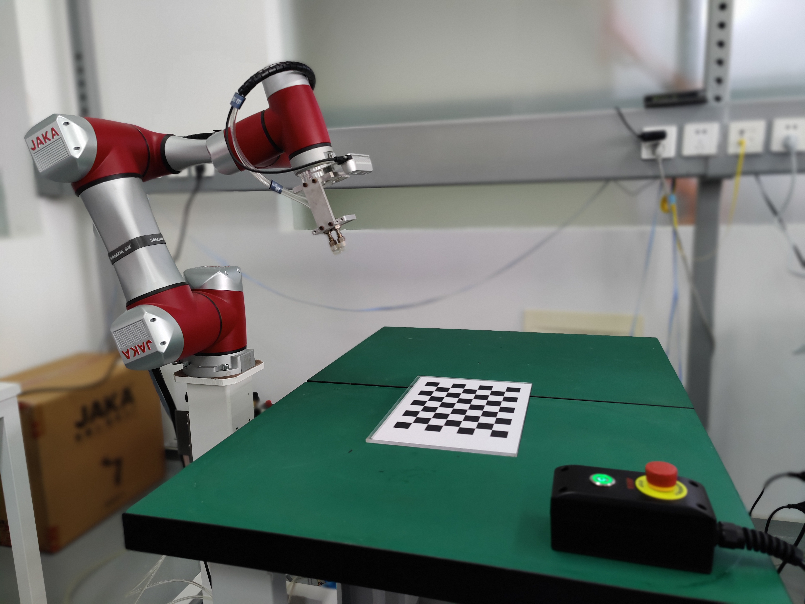

# This ROS package is for the basic motor functions of JAKA robot. 


# Abstract
- Project name: **jaka_controller_tcp_ros**
- This repo is a cmake project for the basic motor functions of JAKA robot.
- Communication protocol is: `TCP/IP`.
- APP/Robot-Firmware/servo-Firmware version: `1.4.11.17/1.4.11_21RC/R-1.10_2.126`

## Dependency

1. jsoncpp:

``` bash
sudo apt-get install libjsoncpp-dev
```

This should install json related header files in `/usr/include/jsoncpp` as we use in the `CMakeLists.txt`.

2. universal_msgs:

```bash
git submodule init
git submodule update
```

And move `universal_msgs` package from `jaka_controller_tcp_ros/dependency/` to `${base_path_to_your_catkin_workspace}/src/`.


3. ros-kinetic-universal-robot package:

```bash
sudo apt install ros-kinetic-universal-robot
```

## Build and Test

Change `robot_IP` in `jaka_ros_node.cpp` or set `robot_IP` dynamically using argv[1]

build:

```bash
cd ${base_path_to_your_catkin_workspace}
catkin_make
```

run:

open one terminal and run:

```bash
roscore
```

open another terminal and run:

```bash
rosrun jaka_controller_tcp_ros jaka_ros_node
```

or set `robot_IP` dynamically using argv[1]:

```bash
rosrun jaka_controller_tcp_ros jaka_ros_node 192.168.x.x
```
